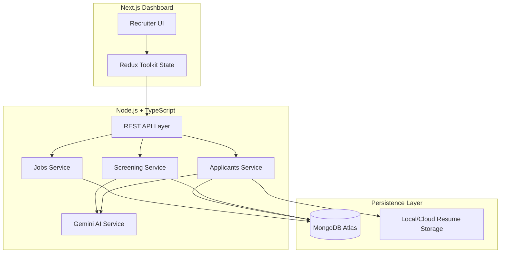

# Scrutiq: AI-Powered Talent Screening Tool

Scrutiq is a production-ready AI application built for the **Umurava AI Hackathon**. It is designed to revolutionize the recruitment process by automating the screening and shortlisting of job applicants. By leveraging the **Gemini AI API**, Scrutiq accurately matches candidates to job requirements, provides explainable reasoning for its decisions, and helps recruiters manage high application volumes with ease.

---

## 🏗️ System Architecture

Scrutiq follows a modern full-stack architecture designed for scalability and isolation.



---

## 🤖 AI Decision Flow

The AI logic in Scrutiq is split into two critical phases: **Extraction** and **Screening**.

### 1. Profile Extraction (Unstructured to Structured)
When a resume (PDF/Word) is uploaded, the system:
- Extracts raw text using `pdf-parse` or `mammoth`.
- Sends the text to Gemini with a specialized prompt to populate the **Umurava Talent Profile Schema**.
- Identifies semantic duplicates to prevent profile stagnation.

### 2. Technical Screening (Ranking & Scoring)
During the screening phase, the AI evaluates candidates against a specific job requirement matrix using a **weighted rubric**:
- **Relevant Experience (30pts):** Matching years and relevance of previous roles.
- **Proof of Results (25pts):** Looking for quantified achievements.
- **Skills Match (25pts):** Calculating the overlap between job requirements and candidate skills.
- **Clarity & Professionalism (10pts):** Evaluating the quality of the resume content.
- **Extras (10pts):** Certifications, portfolios, and unique projects.

**Explainability:** For every candidate, the AI generates natural-language reasoning covering specific **Strengths** and **Weaknesses**, ensuring recruiters remain in control of the final hiring decision.

---

## 🛠️ Technology Stack

- **Frontend:** Next.js (App Router), Tailwind CSS, Redux Toolkit
- **Backend:** Node.js, TypeScript, Express
- **Database:** MongoDB (Mongoose)
- **AI:** Gemini API (1.5 Flash)
- **Deployment:** Vercel (Frontend), Render (Backend)

---

## 🚀 Setup Instructions

### Prerequisites
- Node.js (v18+)
- MongoDB Atlas account
- Google AI (Gemini) API Key

### Installation

1. **Clone the repository:**
   ```bash
   git clone https://github.com/albert-ei-u/umurava-project-.git
   cd umurava-project-
   ```

2. **Backend Setup:**
   ```bash
   cd server
   npm install
   ```
   Create a `.env` file in the `server` directory:
   ```env
   PORT=5000
   MONGO_URI=your_mongodb_uri
   GEMINI_API_KEY=your_gemini_key
   JWT_SECRET=your_secret
   ```
   Start the backend:
   ```bash
   npm run dev
   ```

3. **Frontend Setup:**
   ```bash
   cd ../client
   npm install
   ```
   Create a `.env.local` file in the `client` directory:
   ```env
   NEXT_PUBLIC_API_URL=http://localhost:5000/api
   ```
   Start the frontend:
   ```bash
   npm run dev
   ```

---

## 📝 Assumptions & Limitations
- **File Types:** Currently supports PDF and DOCX for resumes.
- **Language:** Optimized for English language profiles and job descriptions.
- **Token Limits:** Screens candidates in batches to respect Gemini API rate limits.